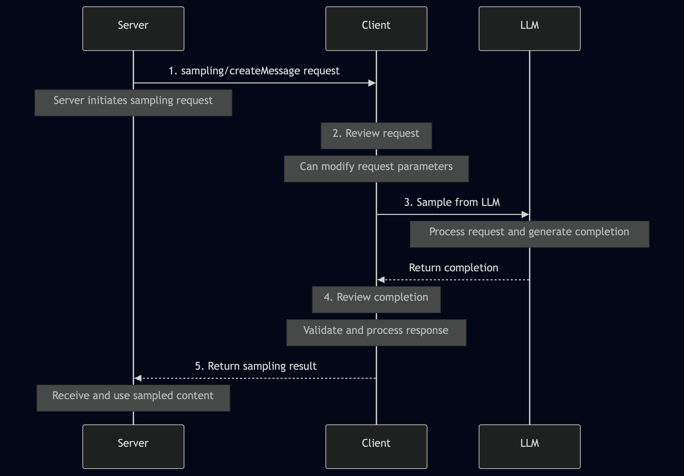
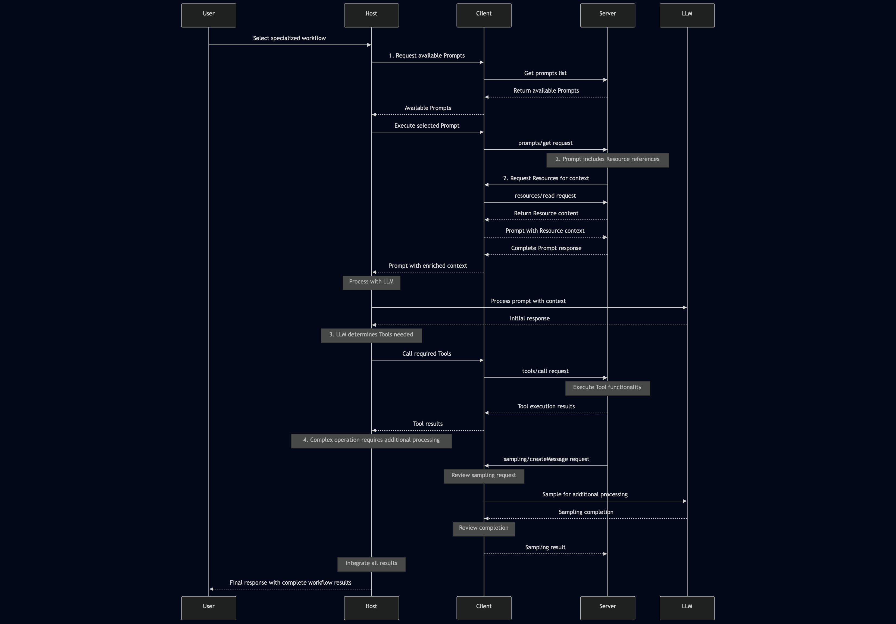

## Introduction

MCP servers expose a range of capabilities to the client (and hence to the LLM) via the communication protocol. These capabilities fall into 4 main categories each of which has distinct characteristics and capabilities.

## Tools

Tools are executable functions that the AI model can invoke to perform actions or retrieve computed data. Typically they are related to the use case of the application. 

* **Control:** These are typically **model-controlled**, meaning that the AI Model (LLM) when to call based on the context and the user's request.
* **Safety:** Due to their ability to execute actions with side affects, tool execution can be dangerous and open to exploitation. Normally the execution of tools from an LLM requires explicit user approval.
* **Use Cases:** Sending messages, creating tickets, querying APIs and performing calculations.

```python
def get_weather(location: str) -> dict:
    """Get the current weather for a specified location."""
    # Connect to weather API and fetch data
    return {
        "temperature": 72,
        "conditions": "Sunny",
        "humidity": 45
    }
```

## Resources

Resources are read-only data sources that can be used to provide additional (or stored) context to the prompts of the LLM.

* **Control:** Resources are application-controlled, meaning the Host application typically decides when to access them.
* **Nature:** They are designed for data retrieval with minimal computation, similar to GET endpoints in REST APIs.
* **Safety:** Since they are read-only, they typically present lower security risks than Tools.
* **Use Cases:** Accessing file contents, retrieving database records, reading configuration information. Loading of context on LLM request (where the context memory is limited)

```python
def read_file(file_path: str) -> str:
    """Read the contents of a file at the specified path."""
    with open(file_path, 'r') as f:
        return f.read()
```

## Prompts

Prompts are pre-defined templates or workflows that can be used to guide the interaction of the user, AI Models and the available capabilities. Prompt templates allow the Host application to provide additional context to the LLM, such as instructions, constraints, or formatting requirements.

* **Control:** Prompts are user-controlled, often presented as options in the Host application’s UI.
* **Purpose:** They structure interactions for optimal use of available Tools and Resources.
* **Selection:** Users typically select a prompt before the AI model begins processing, setting context for the interaction.
* **Use Cases:** Common workflows, specialized task templates, guided interactions.

```python
def code_review(code: str, language: str) -> list:
    """Generate a code review for the provided code snippet."""
    return [
        {
            "role": "system",
            "content": f"You are a code reviewer examining {language} code. Provide a detailed review highlighting best practices, potential issues, and suggestions for improvement."
        },
        {
            "role": "user",
            "content": f"Please review this {language} code:\n\n```{language}\n{code}\n```"
        }
    ]
```

## Sampling

Sampling is a server-initiated request for the client to perform LLM interactions, enabling recursive actions where the LLM can review generated content and make decisions based on it.

* **Control:** Sampling is server-initiated but requires Client/Host facilitation.
* **Purpose:** It enables server-driven agentic behaviors and potentially recursive or multi-step interactions.
* **Safety:** Like Tools, sampling operations typically require user approval.
* **Use Cases:** Complex multi-step tasks, autonomous agent workflows, interactive processes.

```python
def request_sampling(messages, system_prompt=None, include_context="none"):
    """Request LLM sampling from the client."""
    # In a real implementation, this would send a request to the client
    return {
        "role": "assistant",
        "content": "Analysis of the provided data..."
    }
```
The following diagram shows the sequence of events for a sampling request:



```markdown
> This human-in-the-loop design ensures users maintain control over what the LLM sees and generates. When implementing sampling, it’s important to provide clear, well-structured prompts and include relevant context.
```
## Capability Interaction

The four primary capabilities work together to provide complex interactions between the LLM and the external tools and data sources. 


|Capability|Controlled By|Direction|Side Effects|Approval Needed|Typical Use Cases|
|---|---|---|---|---|---|
|Tools|Model (LLM)|Client → Server|Yes (potentially)|Yes|Actions, API calls, data manipulation|
|Resources|Application|Client → Server|No (read-only)|Typically no|Data retrieval, context gathering|
|Prompts|User|Server → Client|No|No (selected by user)|Guided workflows, specialized templates|
|Sampling|Server|Server → Client → Server|Indirectly|Yes|Multi-step tasks, agentic behaviors|

The different capabilities complement one another as shown in the following diagram:



The distinction between these primitives provides a clear structure for MCP interactions, enabling AI models to access information, perform actions, and engage in complex workflows while maintaining appropriate control boundaries.

## Discovery Process

One of MCP’s key features is dynamic capability discovery. When a Client connects to a Server, it can query the available Tools, Resources, and Prompts through specific list methods:

* **tools/list:** Discover available Tools
* **resources/list:** Discover available Resources
* **prompts/list:** Discover available Prompts

This dynamic discovery mechanism allows Clients to adapt to the specific capabilities each Server offers without requiring hardcoded knowledge of the Server’s functionality.
