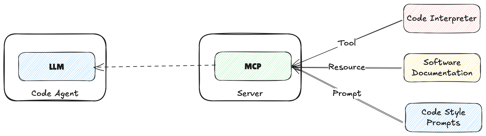

## Introduction

Model Connection Protocol (MCP) is a standardized protocol for enabling structured, reliable communication between AI models (e.g., large language models) and external tools, data sources, or services. Similar to protocols like HTTP or USB-C in their respective domains, MCP provides a consistent and interoperable interface for extending the capabilities of AI systems.

MCP defines how tools describe themselves, how requests are made and fulfilled, and how responses are structured—allowing developers to integrate external functionality with AI agents in a predictable, language-agnostic way. Using standardized terminology and data formats is essential to ensure compatibility across different platforms and use cases.

## MCP Basics

MCP is a protocol for connecting AI models to external tools, data sources, or services. It defines a set of standardized messages and formats for communication between the AI model and the external system.

There are 3 primary components that interact within MCP:

1. Host. The user facing AI application that the user will interact with. Examples include Anthropic’s Claude Desktop, AI-enhanced IDEs like Windsurf or Cursor, inference libraries like Hugging Face Python SDK, or custom applications built in libraries like LangChain or smolagents. Hosts initiate connections to MCP Servers and orchestrate the overall flow between user requests, LLM processing, and external tools. The Host is selected by the User based on requirements and preferences.
The Host is responsible for:
- Managing User interactions and permissions/entitlements
- Initiating the connection to an MCP Server via an MCP Client
- Orchestrating the overall flow between user requests, LLM processing, and external tools
- Rendering the output of the LLM to the user in a coherent or structured format
2. Client. This is a component of the Host application and it has the responsibility to communicate with the MCP Server. Given the purpose of the MCP protocol to reduce the number of interactions each Host Application needs to manage, a Client will interact with a single MCP Server, it maintains a 1:1 connection with a Single Server instance. Its purpose is to handle the protocol-level details of MCP communication acting as the intermediary between the Host application logic and the external Server.
- Each client maintains a 1:1 connection with a single MCP Server
- Handles all the protocl-level details of the MCP communication
- Acts as an intermediary(client) between the Host application logic and the external Server
3. Server. An external service or program that exposes a set of tools or capabilities to the AI model. Servers implement the MCP protocol to define how tools are described, how requests are made, and how responses are structured. Examples include code repositories, file systems, or custom tools built using MCP toolkits.
- Provides access to external tools, data sources and services
- Acts as a lightweight wrapper or facade to existing functionality
- Can run locally (on the same machine as the host) or remotely (over a network)
- Exposes capabilities (services) in a standardised way using MCP that can then be discovered and used by the Client

## Capabilities

In the MCP Basics section the idea of an MCP Server interacting with a defined protocol is introduced. It is shown interacting with different types of tools.
In reality an application that implements MCP will have want a variety of capabilities to be able to complete its tasks. The commons set of capabiltiies are shown below:

| Capability | Description | Example |
| --- | --- | --- |
| Tools | Executable functions that the AI model can invoke to perform actions or retrieve computed data. Typically they are related to the use case of the application. | A tool for a weather application might expose a function that provides the weather at a specific location. |
| Resources | Read-only data sources that can be used to provide additional context to the prompts of the LLM. | A set of papers of existing research on a topic. |
| Prompts | Pre-defined templates or worflows that can be used to guide the interaction of the user, AI Models and the available capabilities| A set of pre-defined prompts |
| Sampling | Server-initiated requests for Client/Host to perform LLM interactions, enabling recursive actions where the LLM can review generated content and make decisions based on it. | A writing applicatin that reviews its own content and the decides whether to mave further revisions. |

### Example
The following presents a sample of a server that implements MCP capabilities for a coding agent.

| Entity | Name | Description |
| --- | --- | --- |
| Tool | Code Interpreter | A tool to execute code the LLM writes |
| Resource | Documentation | A resource for the documentation of the application |
| Prompt | Code Style | A prompt to guide the LLM to generate code in a specific style |
| Sampling | Code Review | A sampling to guide the LLM to review code and make decisions based on it |

## Communication Flow

The following diagram shows the communication flow between the Host, Client and Server.

The architecture is designed to be modular. A single **Host** can connect to multiple **Servers** simultaneously using different **Clients**. This allows the Host to leverage the capabilities of multiple servers and clients to perform complex tasks and new **Servers** to be added without requiring changes to existing **Hosts**. Capabilities can be composed across different **Servers** and **Clients** to create complex workflows.

The standardisation of the protocol allows for a wide variety of **Servers** to be used by a **Host**. This includes servers running locally on the same machine as the **Host** or remote servers running on different machines or even different networks. There is a clear separation of responsibilities between components and allows AI models to connect to an ecosystem of externall tools and data sources.

## Conclusion
The following are the 5 primary principles driving the design of MCP:
### Standardisation
The protocol emphasizes standardization by providing a universal protocol for AI connectivity
### Simplicity
Maintains simplicity by keeping the core protocol straightforward yet enabling advanced features.
### Safety
Safety is prioritised by requiring explicit user approval for sensitive operations, and discoverability enables dynamic discovery of capabilities. 
### Extensibility
The protocol is built with extensibility in mind, supporting evolution through versioning and capability negotiation
### Interoperability
The protocol ensures interoperability across different implementations and environments.