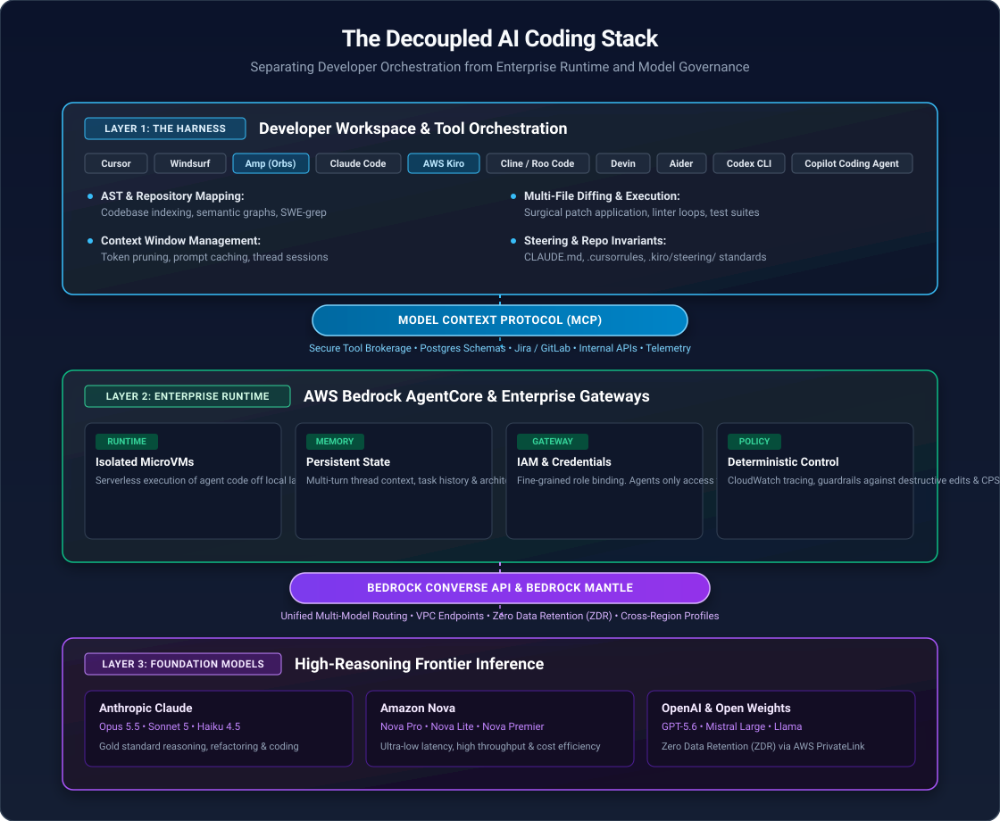

The landscape of AI-assisted software development has shifted dramatically over the past eighteen months. What began as glorified autocomplete has matured into full agentic engineering: autonomous multi-file refactoring, background reasoning threads, spec-driven planning, and self-hosted execution sandboxes.

I have spent a significant amount of time testing, breaking, and integrating different tools across this ecosystem. While I once hoped to find a single, all-encompassing platform to standardise on, the reality of late 2026 is that the ecosystem is bifurcating: **the harness is decoupling from the model.**

Understanding this separation – and how modern platforms like Sourcegraph's Amp, AWS Kiro, and AWS Bedrock AgentCore fit into the architecture – is the key to building an AI coding capability that scales safely beyond prototypes and into enterprise production.

---

## 1. Beyond the Vibes: The Myth of Passive Coding

In February 2025, Andrej Karpathy coined the phrase **'vibe coding'**, describing a style of development where an engineer simply prompts an LLM, lets the agent write the code, and essentially 'gives in to the vibes', forgetting the underlying code even exists.

While that framing captures the fluid excitement of rapid prototyping, it can be profoundly misleading when applied to professional software engineering.

As Andrew Ng pointed out at the LangChain Interrupt conference:

> *"It's unfortunate that it's called vibe coding. It's misleading a lot of people into thinking, just go with the vibes, you know — accept this, reject that. Coding with AI is a deeply intellectual exercise."*

Ng's critique cuts to the core of the discipline. Letting an agent generate 500 lines of unverified code in ten seconds is not engineering; it is simply generating unassured inventory.

When generation is cheap and ubiquitous, the bottleneck shifts entirely from *writing* code to **specifying intent and verifying correctness**. Professional AI engineering is not about surrendering to the vibes; it is about establishing strong invariants, rigorous test harnesses, and declarative contracts that keep the agent constrained.

A concrete expression of this discipline is the emergence of **repo-level rules/spec files** — `CLAUDE.md`, `.cursorrules`, `AGENTS.md`, and AWS Kiro's `.kiro/steering/` directory — markdown documents checked into the repository that encode coding standards, forbidden operations, and architectural invariants the agent must respect on every task. These files are rapidly becoming the de facto mechanism for turning "establish strong invariants" from an aspiration into something enforced at the harness level.

---

## 2. The Architectural Paradigm: Decoupling the Harness from the Model

Early adopters were forced into monolithic setups: you used Cursor with Anthropic's hosted API, or GitHub Copilot with OpenAI's backend. Your context retrieval, tool execution, and foundation models were bundled into a proprietary black box.

In enterprise and regulated environments (particularly under governance frameworks like CPS 234), that model quickly breaks down due to data sovereignty, VPC perimeter controls, auditability, and cost governance.

Today, the leading architectural pattern separates the AI coding stack into three distinct layers:



### Layer 1: The Agent Harness
The harness is the execution environment running on your machine or in an orchestration container. It owns the developer user experience, parses repository Abstract Syntax Trees (ASTs), constructs the context window, executes shell commands, runs test suites, and applies diffs to disk.

### Layer 2: The Interconnect (Model Context Protocol - MCP)
MCP has become the universal standard connecting harnesses to the external world. Instead of each coding tool writing custom integrations for Postgres, GitLab, Jira, or Datadog, any MCP-compliant harness can plug into standard MCP servers to pull live schema definitions, incident logs, or regulatory policies directly into the agent's reasoning loop.

This openness cuts both ways. An MCP server that pulls live Jira tickets, PR comments, or scraped documentation into the agent's context is also a vector for **prompt injection** — a maliciously worded ticket description or comment can instruct the agent to exfiltrate secrets, disable a security check, or modify code outside its intended scope. Treat third-party MCP servers the way you'd treat any new dependency: vet the publisher, pin versions, and scope the permissions/credentials each server is granted as tightly as possible.

### Layer 3: The Enterprise Infrastructure (AWS Bedrock & AgentCore)
Rather than pointing developer machines at public SaaS endpoints, enterprise teams increasingly point their harnesses at **AWS Bedrock**, or, for Anthropic's models specifically, the newer **Claude Platform on AWS** (Anthropic's native API/console surface billed through AWS Marketplace, as an alternative to the Bedrock-managed path — Bedrock keeps content inside AWS infrastructure, Claude Platform on AWS routes it to Anthropic, so the choice has a direct data-residency implication for CPS 234 purposes).

This brings critical structural benefits:
* **VPC Data Isolation:** Prompts and source code stay within the organisation's AWS boundary when using Bedrock. Anthropic's current-generation models run with Zero Data Retention (ZDR) enabled by default on Bedrock and do not train on customer proprietary IP.
* **Bedrock Converse API:** A unified API interface allowing harnesses to switch between Anthropic Claude, Amazon Nova, OpenAI's GPT-5.6 family, and open-weights models without rewriting client code. A newer `bedrock-mantle` endpoint also exposes an Anthropic-native Messages API surface directly within AWS infrastructure for teams that want first-party Claude API semantics without leaving AWS.
* **Amazon Bedrock AgentCore:** The infrastructure substrate for production agents, AgentCore handles the heavy lifting that local CLI tools cannot:
  * **Runtime:** Serverless, ephemeral microVM environments that execute agent-generated code in isolated sandboxes away from developer workstations or production clusters.
  * **Memory:** Persistent cross-session context and thread history.
  * **Gateway & Identity:** IAM-backed access controls ensuring agents can only call permitted tools with verified credentials.
  * **Policy:** Real-time deterministic guardrails that block unauthorized destructive operations (e.g. dropping production databases or bypassing security scans).
  * **Observability:** Unified, CloudWatch-integrated tracing across agent sessions — the component that turns "an agent did something" into an auditable record of what, when, and under whose identity, which is directly relevant to CPS 234/SOC 2 evidence requirements.

---

## 3. The Late-2026 Tooling Landscape

The tools currently in active use can be divided into five distinct categories.

### 1. Spec-Driven Agentic IDEs
A newer category that inverts the usual "prompt, then generate" flow by forcing a planning artefact before any code is written.

* **AWS Kiro:** AWS's ground-up replacement for Amazon Q Developer, reaching general availability on 7 May 2026. Built on Code OSS (the VS Code open-source base), Kiro's defining idea is that every piece of work starts as a **spec** — a requirements document, a design document, and a task list — which are written into the repository under `.kiro/` and stay there as the source of truth alongside the code, rather than existing only as ephemeral chat history. **Steering files** (`.kiro/steering/`) capture persistent project knowledge and coding conventions the agent must follow, and **agent hooks** trigger background agentic tasks on file changes or pipeline events (effectively CI/CD for agent workflows). Kiro runs Claude via Amazon Bedrock, is available as an IDE, CLI, and web interface, and — being an AWS product — inherits AWS's account-level IAM, GovCloud, and compliance posture rather than holding separate product-level certifications of its own. **Amazon Q Developer closed to new signups on 15 May 2026 and retires 30 April 2027**, with Kiro as its designated successor; any team still standardised on Q Developer should treat this as a forcing function to evaluate Kiro now.

### 2. Autonomous & Cloud-Native Agents
These tools move beyond the local text editor, treating the agent as an asynchronous teammate capable of taking a task, opening an environment, running tests, and opening a Pull Request.

* **Amp (Amp Code by Sourcegraph):** Leveraging Sourcegraph's global code graph, it navigates monorepos with unmatched contextual depth. Its flagship feature is **'Orbs'** – ephemeral cloud sandbox environments where Amp executes tasks independently. You can trigger an Amp thread, close your laptop, and return to find the tests executed and a clean branch prepared. It also introduces dynamic model routing dials (from low-latency passes to deep 'Oracle' reasoning).
* **Claude Code:** Anthropic's official CLI-first agentic developer. It lives directly inside your terminal, understands Git status, executes tests natively, and features exceptionally fast inline diffing, command execution, and sub-agent delegation.
* **Devin (Cognition AI):** One of the original "fully autonomous software engineer" products, now on Devin 2.0. Devin takes a ticket-level task, plans it, executes it end-to-end in its own sandboxed environment, and raises a PR with minimal supervision. Cognition has since also acquired Windsurf (see below), making it a two-product company spanning both the autonomous-agent and interactive-IDE ends of the spectrum.
* **OpenAI Codex CLI:** OpenAI's terminal agent, rewritten in Rust for speed, running on the GPT-5 family and executing multi-step tasks in isolated cloud sandboxes. Supports multi-agent threads via the companion macOS app. Bundled with ChatGPT Plus/Go subscriptions, which makes it a low-friction entry point for teams already paying for ChatGPT.
* **GitHub Copilot Coding Agent:** GitHub's autonomous agent, distinct from the inline "Copilot Edits" feature — it runs inside GitHub Actions environments, takes an assigned issue, works independently, and opens a PR for review. Paired with **GitHub Copilot CLI**, which reached general availability on 25 February 2026, Copilot has moved decisively from an autocomplete tool into the same autonomous-agent category as Amp, Devin, and Codex CLI.
* **Aider:** The open-source gold standard for terminal-based pair programming. Its dual-model 'Architect / Editor' pattern and Git-aware commit hygiene remain benchmark practices.
* **OpenHands (formerly OpenDevin):** An autonomous software engineer running inside isolated Docker containers, capable of executing complex end-to-end task backlogs.

### 3. Agentic IDEs
For interactive, flow-state engineering, specialised IDEs remain the most accessible daily environment.

* **Cursor:** Continues to lead commercial adoption. **Cursor 2.0** introduced an agent-centric interface built around **Composer**, Cursor's first proprietary coding model (claimed ~4x faster than comparable models at similar intelligence, optimised for low-latency agentic coding). The headline feature is native **multi-agent support** — up to eight agents can run in parallel on the same task, isolated via Git worktrees or remote machines, with a unified sidebar for comparing and selecting the best result. Browser-based testing and sandboxed terminal execution, previously in beta, are now generally available, alongside a voice-control mode.
* **Windsurf:** Following OpenAI's collapsed $3B acquisition attempt, Google hired Windsurf's CEO and key R&D staff in a licensing deal, and Cognition (Devin's maker) acquired the remaining Windsurf business. Under Cognition, Windsurf shipped **Wave 13** with multi-agent sessions, Git worktree isolation, and **SWE-grep** for fast repository context retrieval — built around its *Cascade* engine, still emphasising deep context grounding and smooth collaborative execution.
* **Antigravity (Google DeepMind):** Google's own agent-first IDE, built in the wake of its Windsurf talent acquisition (and reportedly forked from Windsurf's codebase). Runs Gemini 3.1 Pro plus multi-model access (including Claude and open-weights models), with a parallel multi-agent manager view and artefact-based task verification.

### 4. Bring-Your-Own-Model (BYOM) Harnesses
These open-source extensions turn standard VS Code into an agentic powerhouse while allowing you to pipe all inference through enterprise gateways like AWS Bedrock.

* **Cline & Roo Code:** These open-source extensions provide autonomous file editing, terminal execution, and MCP tool access directly inside VS Code. Crucially, they natively support AWS Bedrock Converse endpoints using your standard AWS IAM credentials, making them a prime choice for regulated corporate environments.
* **Continue.dev:** Another open-source BYOM extension for VS Code and JetBrains, with native Bedrock support — same category and use case as Cline/Roo Code, worth evaluating alongside them for teams wanting an Apache-licensed option.
* **Gemini CLI:** Google's open-source terminal agent, extensible via its own plugin/extension mechanism, usable with Gemini models directly or through Google AI Pro subscriptions.

### 5. Browser-Based Full-Stack Builders (The Prototyping Tier)
For greenfield scaffolding and rapid UI iteration, web-based tools generate full applications in minutes:

* **v0 (Vercel):** Exceptional component-level UI generation using React, Tailwind, and Shadcn UI.
* **Lovable & Bolt.new:** Full-stack generators that scaffold frontend, backend, and Supabase databases in a live, in-browser container.
* **Replit Agent:** Prompt-to-deployed-app generation with built-in hosting, positioned as the "no local environment at all" end of this tier.

---

## 4. Feature Comparison Matrix

### Spec-Driven & Agentic IDEs

| Tool | Primary UX | Planning Model | Multi-File Editing | BYOM / Bedrock Support | Best Suited For |
| :--- | :--- | :--- | :--- | :--- | :--- |
| **Kiro** | Dedicated IDE + CLI | Spec-first (requirements/design/tasks before code) | Steering-constrained workspace | Managed (Claude via Bedrock) | AWS-native regulated shops wanting enforced planning |
| **Cursor** | Dedicated IDE | Plan Mode (optional) | Composer / up to 8 parallel agents | API Keys / Enterprise | All-round power users, large codebases |
| **Antigravity** | Dedicated IDE | Artefact-based verification | Parallel multi-agent manager | Managed (Gemini + multi-model) | Deep agentic development & verification |
| **Windsurf** | Dedicated IDE | Cascade Engine | Wave 13 multi-agent sessions | Managed / Enterprise | Collaborative interactive coding |
| **Roo Code / Cline** | VS Code Ext | Open / Edit / Run | Deep (configurable) | **Native Bedrock / BYOM** | Regulated enterprise & custom models |
| **GitHub Copilot** | Extension / CLI / Agent | Copilot Edits + Coding Agent | Moderate–High (GitHub Actions sandbox) | GitHub Hosted | Corporate standardisation at scale |

### Terminal & Autonomous Agents

| Tool | Execution Model | Sandbox Type | Monorepo Intelligence | Notable Feature |
| :--- | :--- | :--- | :--- | :--- |
| **Amp (Sourcegraph)** | CLI / Web / IDE | **Cloud 'Orbs'** (Async) | Industry-leading (Code Graph) | Works with laptop closed; model dials |
| **Claude Code** | Terminal CLI | Local Host | High (Git-aware) | Blazing fast CLI flow & sub-agents |
| **Devin 2.0 (Cognition)** | Cloud Agent | Fully managed sandbox | Moderate–High | Ticket-to-PR autonomy with minimal supervision |
| **OpenAI Codex CLI** | Terminal CLI (Rust) | Cloud sandbox | Moderate | Multi-agent threads via companion app |
| **GitHub Copilot Coding Agent** | GitHub Actions | Actions-managed sandbox | High (GitHub-native) | Issue-assigned, opens PR autonomously |
| **Aider** | Terminal CLI | Local Host | High (Repo Map) | Architect/Editor model duality |
| **OpenHands** | Web / CLI | Docker Container | Moderate | Fully autonomous sandboxed agent |

---

## 5. Recipe: Connecting Local Harnesses to AWS Bedrock

For teams operating under strict compliance rules where source code cannot be sent to third-party consumer endpoints, here is how a modern decoupled stack is typically configured:

1. **Model Endpoint:** Provision model access in AWS Bedrock (e.g. Claude Opus 5.5 or Claude Sonnet 5) in your preferred AWS region (e.g. `ap-southeast-2` for Australian data residency). Note that current-generation Claude models are generally accessed via cross-region inference profiles rather than static on-demand throughput — check the Bedrock model-lifecycle page for the retirement date of any pinned model ID before building a hard dependency on it.
2. **Authentication:** Authenticate the developer machine using standard AWS IAM Identity Center (SSO) credentials:
   ```bash
   aws sso login --profile enterprise-dev
   ```
3. **Harness Configuration (e.g. Roo Code / Cline):**
   * Provider: `AWS Bedrock`
   * Region: `ap-southeast-2`
   * Model ID: current Claude Sonnet or Opus inference profile ID (check AWS's live Bedrock model catalogue — model IDs are versioned and periodically retired)
   * Profile: `enterprise-dev`
4. **Tool Extension via MCP:** Connect the harness to local and enterprise MCP servers (e.g. local PostgreSQL schema inspector, corporate Jira connector, and internal Git server) — vetted and version-pinned per the supply-chain note in Section 2.

This setup gives engineers the full autonomous power of modern agentic coding while keeping every byte of source code, schema information, and inference token within the enterprise's private cloud perimeter.

---

## 6. Key Adoption Recommendations

When evaluating where to invest team effort, consider the following heuristics:

* **Separate the Harness Decision from the Model Decision.** Do not lock your team into an IDE just because you like a particular model. Models evolve on a roughly quarterly cycle (Claude alone has moved through Sonnet 4.5 → 4.6 → 5 and Opus 4.6 → 4.8 → 5 → 5.5 within the past twelve months); your developer workflow and tooling harness need longevity.
* **Insist on MCP Support.** Any tool that does not support the Model Context Protocol is creating an isolated silo. MCP is how your coding agent understands your internal database schemas, API specs, and issue trackers — but treat every MCP server as a vetted dependency, not a free integration (see Section 2).
* **Consider Spec-Driven Tools for High-Governance Work.** For teams under CPS 234 where "what did the agent build and why" needs to be answerable after the fact, Kiro's enforced requirements/design/task artefacts give you a durable planning record that chat-based harnesses don't produce by default.
* **Adopt Asynchronous Agents for Heavy Refactoring.** For multi-module migrations, dependency upgrades, or test backfilling, tools like **Amp** (with cloud Orbs), **Claude Code**, **Devin**, and **GitHub Copilot Coding Agent** outperform interactive chat by running autonomously against the compiler and test suite.
* **Treat Agent-Authored Diffs Like Any Other Diff.** Regardless of how autonomously a PR was generated, it still goes through the same code-review and approval gates as human-authored code. None of the "opens a PR" claims in Section 3 should be read as implying unsupervised merge — for a regulated environment this is the single most important control to make explicit in team process documentation.
* **Set Budget Guardrails on Autonomous Agents.** Background agents that loop against a failing test or an ambiguous spec can burn tokens unsupervised; pair async agent adoption with spend caps or alerts (AgentCore and Bedrock both expose the usage data needed for this).
* **Go Beyond Agent-Written Unit Tests for Verification.** An agent can hallucinate or quietly weaken its own tests to make them pass. Property-based testing and mutation testing provide a stronger, less gameable verification layer than unit tests alone when an agent is doing a meaningful share of the implementation.
* **Keep Humans Accountable for Intent.** As systems like Bedrock AgentCore make code cheaper to generate and execute, the engineer's true value lies in specification, architectural boundaries, and rigorous verification. AI generates the implementation; the engineer remains accountable for the outcome.