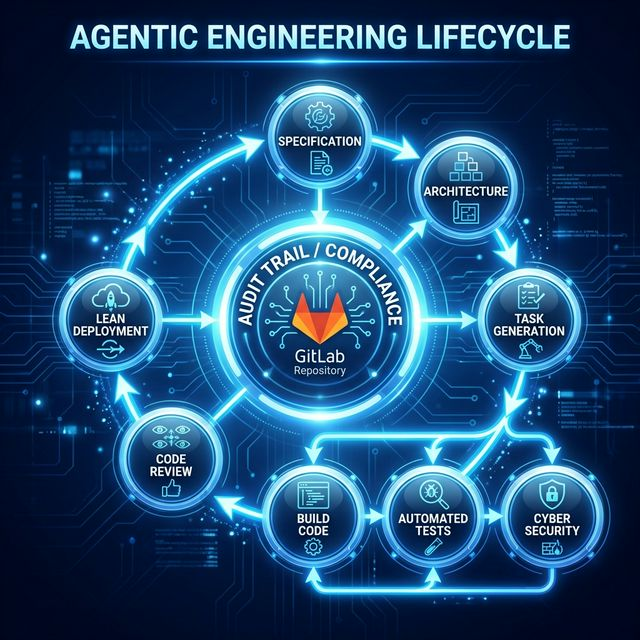
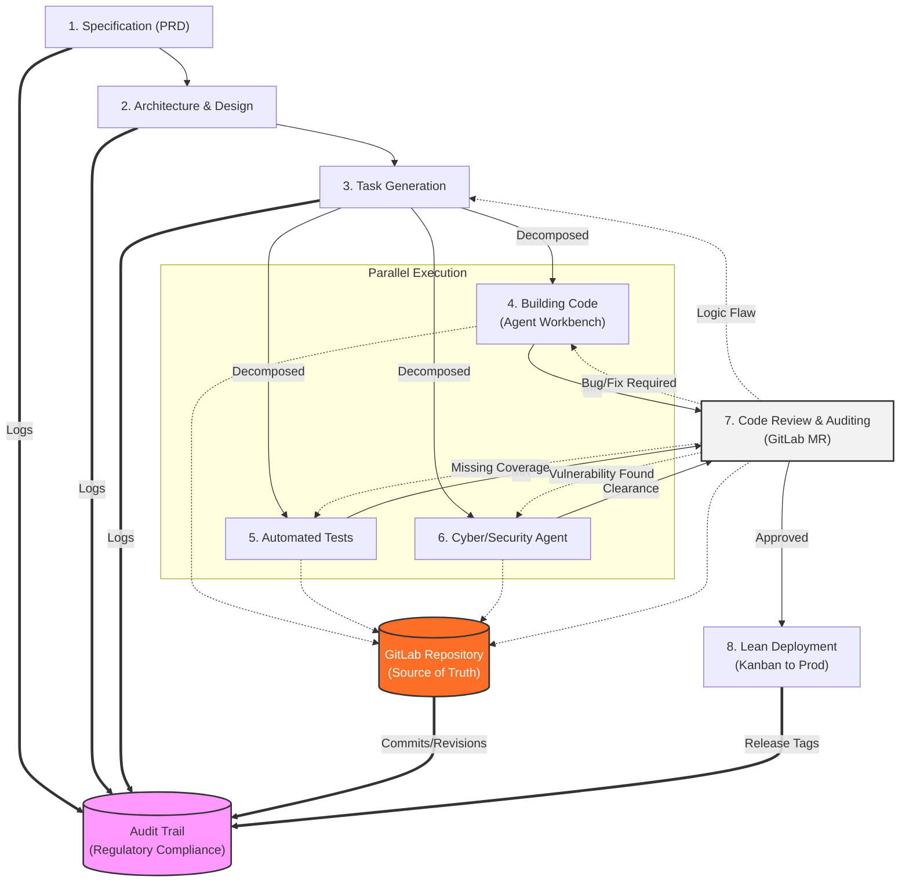

# The Agentic Engineering Lifecycle

Traditional Software Development Life Cycles (SDLC) assume human engineers writing every line of code by hand. In the era of AI coding assistants and autonomous agents, the bottleneck shifts from *writing code* to *writing specifications*. 

This document outlines our **Specification-Led Delivery** lifecycle. It acts as a hub pointing forward to how we leverage agentic tools at every phase of product development to generate, test, and review software.

---

*(The flowchart below details the parallel task execution paths captured in the diagram above)*

---

## 1. Specification (The New "Coding")

In an agentic workflow, the natural language specification *is* the source code. If the spec is vague, the generated code will be brittle. 

* **The Goal**: Write exhaustive product requirements documents (PRDs) that leave no room for agent hallucination.
* **Agentic Tools Used**: Chat interfaces (ChatGPT, Claude, Gemini, Jules), requirements gathering templates.
* **Deep Dive**: [How to Write Agent-Ready Specifications](specifications.md) (Coming Soon)

## 2. Architecture & Design

Agents are excellent at scaffolding code, but they struggle with creating holistic, distributed system architectures from scratch without guidance. 

* **The Goal**: Produce a `DESIGN.md` or architecture diagram that constrains the agent's technology choices and structural patterns.
* **Agentic Tools Used**: v0, Lovable (for UI prototyping), architectural prompting patterns.
* **Deep Dive**: [Constraining Agents with Architecture Definitions](architecture_design.md) (Coming Soon)

## 3. Incremental Task Generation & Decomposition

Instead of feeding an entire PRD to an agent and hoping for the best, the work must be broken down into discrete, testable steps. **This step feeds the parallel tracks below.**

* **The Goal**: Convert specifications into a sequential `task.md` or Epics/Tickets that an agent can execute one at a time.
* **Agentic Tools Used**: Agentic planners (like Kiro or custom LLM task-breakdown prompts).
* **Deep Dive**: [Breaking Down Work for Agentic Execution](task_generation.md) (Coming Soon)

## 4. Building Code (Parallel Track A)

This is where the actual code is manifested. Rather than writing files manually, the engineer acts as an orchestrator, reviewing the agent's proposed changes.

* **The Goal**: Execute tasks rapidly via multi-file editors. Output is pushed as Merge Requests (MRs) to **GitLab**, which acts as our central Source of Truth.
* **Agentic Tools Used**: Deeply integrated IDE agents (Antigravity, Cursor Composer, Windsurf), GitHub Copilot Edits, and CLI tools (Aider, Jules).
* **Deep Dive**: [Effective Vibe Coding: Scaffolding and Generation](building_code.md) (Coming Soon)

## 5. Automated Test Generation (Parallel Track B)

Code and the tests that validate it are generated synchronously by agents. Test-Driven Development (TDD) pairs perfectly with agentic workflows.

* **The Goal**: Generate comprehensive unit and integration tests *before* or immediately after feature generation to prevent regressions. Push test cases to GitLab.
* **Agentic Tools Used**: Windsurf, GitHub Copilot.
* **Deep Dive**: [Agent-Driven TDD and Test Generation](test_generation.md) (Coming Soon)

## 6. Cyber / Security Agent (Parallel Track C)

As soon as a task is generated, security tools begin evaluating the proposed dependencies, architecture, and code snippets.

* **The Goal**: A specialized **Cyber/Security Agent** (e.g., SAST, DAST, dependency scanners) automatically audits the work for vulnerabilities, hardcoded secrets, and compliance violations before it can be merged.
* **Agentic Tools Used**: GitLab CI/CD, LLM Security Scanners.
* **Deep Dive**: [Securing and Validating Agentic Code in CI/CD](ci_cd_security.md) (Coming Soon)

## 7. Code Review & Auditing (Convergence Loop)

The parallel tracks converge back together in a GitLab Merge Request. When code is generated at high speed, traditional line-by-line review processes break down. The focus shifts to reviewing the *behavior* and the *security* of the generated output. **If any track fails, an iterative feedback loop automatically kicks the code back to Step 3, 4, 5, or 6.**

* **The Goal**: Ensure AI-generated code meets non-functional requirements (security, performance, maintainability) before merge.
* **Agentic Tools Used**: Automated MR assistants (GitLab Duo).
* **Deep Dive**: [Performing Code Reviews on AI-Generated Code](code_reviews.md) (Coming Soon)

## 8. Lean Deployment (Kanban to Production)

We prioritize continuous delivery of validated, bite-sized tasks over massive sprint-cycle releases.

* **The Goal**: Utilize a Lean, Kanban-style flow where tickets move from Specification directly through to Production the moment they clear the Code Review and pipeline. This ensures AI-generated features are shipped iteratively and incrementally, drastically reducing integration risk and time-to-market.
* **Deep Dive**: [Lean Deployments in an Agentic Workflow](lean_deployment.md) (Coming Soon)