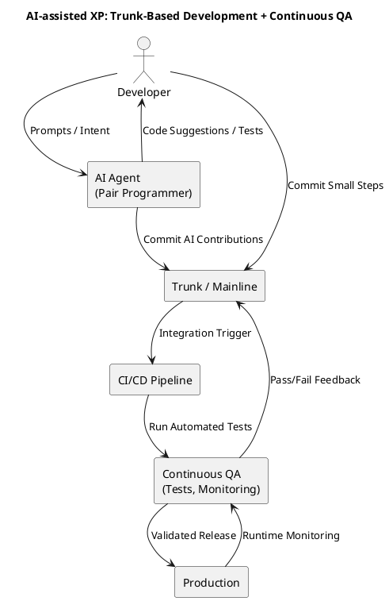

## Introduction

Extreme Programming ([XP](https://www.extremeprogramming.org/)) is a software development methodology that emphasizes the importance of delivering working software to customers as quickly as possible.

I was struck by what seemed to be some comments on AI coding assistance that highlighted a number of key findings about the approaches that engineers found more successful:
* Prompt using test cases or examples
* Work in small steps
* Test continuously
* Review code and refactor continuously
* Commit after every small step when the tests pass
* Sync with the trunk branch often

It appears that a lot of the things that are attributing to LLMs and MCP are actually also about improving the approach to engineering. I am not saying that having a coding colleague as productive and knowledgeable as an AI Agent is not going to make a significant difference, but just like in all teams we need to work out how best to interact to get the highest level of productivity.

Looking at the above list there are a couple of things that leap out, which seem to align with established thinking - Test Driven Development(TDD), Specification by Example and Continuous Integration.

Maybe what we are seeing though is that AI generated code is moving us closer to a pure form of XP. Where the secret as Michael Fowler pointed out [here](https://martinfowler.com/bliki/SpecificationByExample.html) is that in XP rather than just doing things once we were always doing things twice (writing the test and writing the code). With AI we can do it once, but we still need to specify the test to ensure what was generated is what we want. (I was going to say 'we' making the Agent part of the team, but I am not sure we can assign sentient behaviour quite yet).

## Key Principles

### Customer Collaboration

### Feedback

### Simplicity

### Continuous Improvement

### Teamwork

## Trunk-Based Development and Continuous QA

These two practices are closely related in both traditional XP and in AI-assisted development. Trunk-based development provides the rhythm of frequent integration, while continuous QA ensures that every integration is automatically validated. When AI agents are generating large amounts of code quickly, the combination of these practices is what prevents chaos and preserves quality.

### Trunk-Based Development

XP has long emphasised integrating with the trunk or mainline frequently, avoiding long-lived branches. With AI-generated code, this discipline becomes even more critical. The risk of drift or large unreviewed merges is amplified when an agent can generate significant amounts of code in minutes.

- **Small Steps**: Encourage both developers and AI agents to work in short iterations, committing frequently.
- **Feature Flags**: Use feature flags to safely integrate incomplete features without blocking the trunk.
- **Human + Agent Collaboration**: Treat the AI as a pair programmer whose work also needs to flow through trunk and be validated by the team’s standards.
- **Governance**: Frequent integration keeps the whole system visible and helps detect when AI output does not align with the intended architecture.

### Continuous QA

Continuous QA extends XP’s practice of continuous testing into a full lifecycle safety net. When AI assists in coding, automated quality checks become the trust boundary.

- **Tests as Specifications**: Writing tests first gives the AI a clear contract to code against, reducing hallucinations.
- **AI-Augmented Testing**: AI can generate additional edge-case tests, fuzzing scenarios, or mutation tests, expanding coverage beyond what humans might anticipate.
- **Pipeline as Gatekeeper**: Every commit from human or agent flows through a robust CI/CD pipeline with automated unit, integration, and acceptance tests.
- **Runtime Validation**: Continuous QA also includes observability and monitoring in production, so that AI-generated changes are not just syntactically valid but operationally sound.

Together, trunk-based development and continuous QA keep the pace of AI-assisted development aligned with the discipline of XP—delivering rapid change without sacrificing reliability.

## Guardrails and Patterns

While trunk-based development and continuous QA provide strong feedback loops, they do not by themselves ensure that AI-assisted development remains within the boundaries of good engineering practice. Guardrails and patterns act as the architectural conscience of the process, ensuring that both human and agent contributions are consistent, secure, and maintainable.

### Why They Matter
AI agents can produce working code that passes tests but still violates enterprise standards or architectural guidelines. Without explicit boundaries, it is easy for inconsistencies, security flaws, or anti-patterns to creep in. Guardrails help ensure long-term maintainability and alignment with organisational practices.

### How to Apply Them
- **Architecture Decision Records (ADRs)**: Capture and surface key decisions so that AI agents and humans alike work with the same architectural intent.
- **Curated Documentation Awareness**: Provide AI tools with access to reference architectures, design patterns, and coding standards to reduce drift.
- **Linting and Policy as Code**: Enforce coding standards and security rules automatically in the CI/CD pipeline using static analysis and policy frameworks.
- **Secure Defaults and Templates**: Supply compliant scaffolds and starter kits so generated code begins with the right patterns in place.
- **Prompting Standards**: Encourage developers to specify required patterns and practices in their prompts (e.g. “implement with repository pattern”).
- **Automated Fitness Functions**: Use architectural fitness functions to continuously validate that the system remains aligned to the intended design.

### Relationship to XP
In traditional XP, refactoring and pair programming spread good practices organically. In AI-assisted XP, those same values are upheld by codifying rules into guardrails and patterns. This ensures that the velocity gained from AI does not come at the cost of quality or architectural integrity.