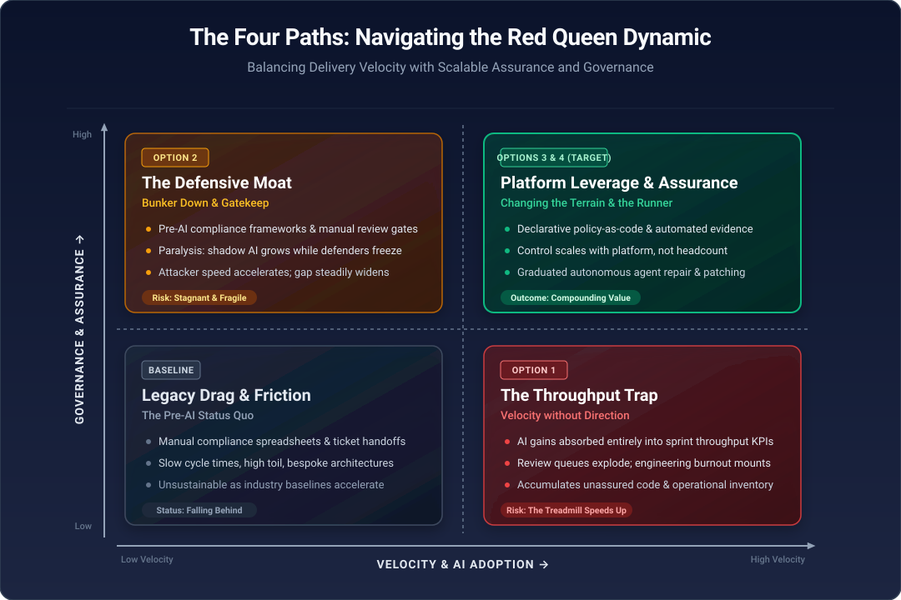

## The Absurdist Race

In Lewis Carroll's *Through the Looking-Glass* (1871), Alice takes the Red Queen's hand and finds herself in a breathless, frantic sprint across the surreal chessboard landscape. Despite running at top speed until she is exhausted, the surrounding trees and scenery never change position.

When they finally stop, Alice finds herself resting under the exact same tree where they began. When she expresses bewilderment – noting that in her world, running fast gets you somewhere else – the Red Queen explains the logic of Looking-Glass land: here, you have to run as fast as you can just to stay in the same place. If you want to actually get somewhere else, you must run at least twice as fast as that.

## The Modern-Day Parallel

I recently heard an economics podcast invoke this same image, and I have since come across several other references to the same absurdist scenario. It resonated with my day-to-day experience, because I think we are living through the same phenomenon in software engineering and cybersecurity.

The scene gave rise to several influential cultural and scientific concepts:

- **The Red Queen Hypothesis (evolutionary biology).** Proposed by Leigh Van Valen in 1973, this principle posits that organisms must constantly adapt, evolve and proliferate simply to survive against ever-evolving opposing organisms (predators, parasites or competitors) in a dynamic ecosystem. Van Valen's striking observation was that the risk of extinction stays roughly constant no matter how long a lineage has already survived. Past success buys no immunity.
- **Economic and business competition.** The phrase is often used to describe markets where companies must relentlessly innovate, spend on R&D and squeeze margins just to maintain their existing market share against rivals doing exactly the same thing.
- **Technological and societal 'treadmills'.** In sociology and philosophy, it serves as a metaphor for the relentless pace of modern life: working longer hours or adopting faster tools merely to keep up with escalating baselines, rather than getting ahead.

AI tooling and cyber threats are both running on the same treadmill, just from opposite sides.

The asymmetry is where things start to get difficult. Defenders and attackers both get faster with AI, but the gains are not symmetric. Attackers need only one success and carry no compliance overhead. Defenders in a regulated environment have to move fast *and* demonstrate control: evidence for CPS 234, audit trails, change governance.

Every acceleration on the delivery side increases the volume of change that has to be assured. If assurance does not scale at the same rate, you are not standing still; you are falling behind while feeling busy. Even though you may have significant productivity improvements, this is the new normal: you are expected, and required, to move ever faster.

This is where the Red Queen's second clause matters. 'Twice as fast to get somewhere else' is the useful line. Running harder at the same things (more tickets closed, more code generated, more patches applied) just holds position. Getting somewhere requires changing what you are running on:

- **Shifting controls left and making them declarative.** Policy-as-code (OPA, Cedar) means a new service inherits enforcement rather than needing a review cycle. The control scales with the platform, not with headcount.
- **Reducing the surface rather than defending it faster.** Fewer bespoke paths, standardised golden paths, smaller dependency footprints. Every thing you do not have is a thing you do not have to patch at AI-accelerated disclosure speeds.
- **Automating assurance, not just delivery.** Continuous evidence generation, so that audit readiness is a by-product of the pipeline rather than a periodic scramble.
- **Treating AI-generated code as higher-volume, lower-provenance input.** The bottleneck moves from writing to verifying, so investment in tests, contract checks and review tooling has to move with it.

The treadmill also carries a hidden cognitive load – or, more accurately, not so hidden. The sociological version of the metaphor, escalating baselines, shows up as teams adopting each new tool to keep pace with expectations that the tool itself raised.

Productivity gains get absorbed into higher throughput KPIs rather than into slack for design thinking or additional time for system hardening. Which raises the question:

> *What is the organisation choosing to spend the AI dividend on?*

If the answer is 'more features', the treadmill speeds up. If some of it is deliberately reinvested in resilience and simplification, you may get some real benefit. But this is a brave call in a competitive and rapidly changing landscape.

A useful test that can be applied to any initiative: does it compound, or does it merely sustain? Running to stay in place is sometimes unavoidable (patching is patching), but a healthy portfolio should have a visible share of work that changes the terms of the race rather than just the pace.

The other question, which has not yet been addressed, is how much we trust the agents themselves to perform the resilience work, the patching and the vulnerability fixes, not just the identification. I return to that below with a graduated model for agent autonomy.

## The Core Premise: Where Does Value Actually Come From?

When generation is cheap and everyone is accelerating, output volume ceases to be a competitive advantage – it becomes table stakes.

If you use AI solely to produce more code, tickets and features, you have not created value; you have just increased the velocity of your treadmill and the volume of assurance required.

Value does not come from running faster; it comes from changing what you are running on.

### Cycle Time to Verified Truth (Latency over Throughput)

Value is not lines of code or closed tickets. It is how fast an idea, hypothesis or security patch safely reaches production and validates itself. Compressing feedback loops from weeks to minutes is compounding value; generating 500 lines of unverified code in 10 seconds is just operational inventory.

### Subtractive Engineering (Reducing Surface Area)

Because AI makes creation friction-free, complexity gets cheaper to build and exponentially more expensive to maintain and assure. True economic value comes from using AI to delete, consolidate and standardise, reducing the surface area that defenders must assure at AI-accelerated disclosure speeds.

### Assurance Decoupled from Headcount

In regulated environments (CPS 234, for example), delivery without assurance is undeployable debt. Value comes from turning governance from an intermittent human tollbooth into continuous, automated platform telemetry.

### Strategic Capital Allocation ('The AI Dividend')

Value comes from the deliberate discipline of not pouring 100% of productivity gains back into feature roadmaps. Capturing real enterprise value requires capturing slack: time to rethink architectures, harden systems and eliminate legacy drag.

## The Options: Four Paths Organisations Take

When faced with the Red Queen dynamic, engineering organisations typically pick (or drift into) one of four operating modes:

### Option 1: The Throughput Trap (Velocity without Direction)

**What it looks like:** Reinvesting all AI efficiency gains into sprint velocity KPIs, backlog burn-down and more features.

**The outcome:** Complexity explodes, review queues become catastrophic bottlenecks, engineers burn out from cognitive thrash, and assurance debt mounts.

### Option 2: The Defensive Moat (Bunker Down and Gatekeep)

**What it looks like:** Applying pre-AI compliance frameworks, heavier manual review gates and risk committee sign-offs to slow down generative tooling.

**The outcome:** Paralysis. Shadow AI sprouts up, developers find workarounds, and while your defenders are frozen in review, attackers continue to accelerate.

### Option 3: Platform Refactoring (Changing the Terrain)

**What it looks like:** Deploying the AI dividend to modernise legacy platforms, mandate declarative golden paths and shift controls left (policy-as-code).

**The outcome:** The platform absorbs complexity so the individual engineer does not have to. Assurance scales with platform adoption, not headcount.

### Option 4: Graduated Autonomous Remediation (Changing the Runner)

**What it looks like:** Moving AI agents from passive 'spotters' (generating alerts and ticket backlogs) to active, bounded 'actors' (automated dependency patches, synthetic regression repair, drift remediation).

**The outcome:** Closes the asymmetry gap against external threats by matching automated attack speeds with automated defensive responses.

## How to Make Decisions: A Decision Framework

To avoid getting trapped on the treadmill, leaders and teams need explicit heuristics.

### 1. The Compounding Test

*'Does this initiative compound our capabilities, or merely sustain our current position?'*

- **Sustaining (treadmill):** routine patching, triage, manually reviewing boilerplate PRs, meeting audit deadlines via manual spreadsheets.
- **Compounding (escape velocity):** declarative policy enforcement (OPA/Cedar), automated compliance evidence pipelines, self-service golden paths, deleting 20,000 lines of obsolete glue code.

**The rule:** Mandate a non-negotiable allocation of engineering capacity to compounding initiatives. The 30–40% I would suggest as a starting point is illustrative rather than empirical; the point is that the figure is explicit, protected and reviewed, not that it is exactly right.

### 2. The Bottleneck / Theory of Constraints Test

*'Are we optimising the step that is actually holding up delivery and safety?'*

If code generation is 5x faster, spending more effort optimising developer prompt tooling yields zero enterprise value if security review or staging assurance takes three weeks.

**The rule:** Point AI leverage at the current constraint – verification, synthetic test generation, contract checking or audit readiness.

### 3. The Net-Complexity Heuristic

*'Did this change reduce our operational footprint or expand it?'*

When evaluating new architectures or AI-assisted initiatives, measure not just feature delivery but also net dependencies added, runtime abstractions created and long-term assurance cost.

### 4. The Agency and Trust Matrix (Deciding Agent Autonomy)

How do we decide when to trust agents to fix and remediate, not just find problems? Use a graduated blast-radius model:

| Level | Role | Action | Verification |
|---|---|---|---|
| **L1: Informational** | Passive advisor | Flags vulnerability or drift in CI | Human triage and human fix |
| **L2: Suggestive** | Drafter | Creates a PR with a targeted test suite | Human review and merge |
| **L3: Bounded auto** | Operator (pre-prod) | Auto-patches non-breaking dependencies and tests in a sandbox | Automated contract verification |
| **L4: Autonomous** | Self-healing (prod) | Bounded rollback, auto-isolation, deterministic policy fix | Telemetry canary and audit event log |

## Where We Go From Here

The Red Queen's race does not end, and Van Valen's point was precisely that. Past survival buys no immunity, and no quantity of effort retires the threat. The aim is not to win the race but to stop running it on the Queen's terms. That means being deliberate about three things.

**First, decide what the dividend is for.** Productivity gains that flow straight into throughput targets are a treadmill speed-up by another name. Make the allocation explicit and visible: how much of the AI dividend goes to features, and how much to hardening, simplification and deletion. If nobody can answer that question, the answer is almost certainly 'all of it'.

**Second, point the acceleration at the constraint.** Generation is no longer scarce. Verification, assurance and remediation are. Invest where the queue actually forms, in policy-as-code, continuous evidence and contract-level testing, so that control scales with the platform rather than with headcount.

**Third, earn autonomy rather than grant it.** The question of whether we trust agents to fix as well as find is best answered the way we treat any new starter: a probationary period with bounded responsibility. Move agents up the ladder from advisor to drafter to bounded operator only when telemetry, audit trails and rollback have demonstrated that the blast radius is contained. Autonomy is a track record, not a configuration setting.

None of this makes the treadmill stop. Attackers will keep accelerating, and so will expectations. But it changes what we are running on. Alice never escaped the chessboard by running faster across a single square; she progressed by advancing across the board to change her position entirely. The organisations that thrive will not be those that run the fastest on a flat treadmill, but those that treat each increment of speed as an opportunity to change the terrain.

The honest test is a simple one. Ask of the next quarter's work: what here compounds, and what merely sustains? Then make sure the first list is not empty.
