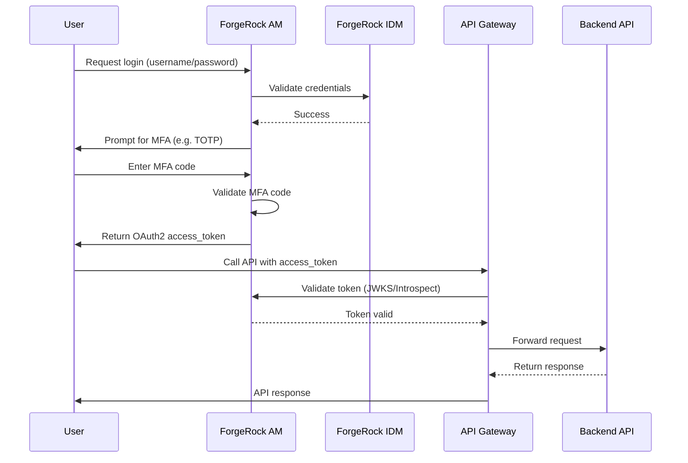

# ForgeRock CIAM with MFA and API Gateway Integration

## 1. Overview

This document outlines the use of **ForgeRock** for **Customer Identity and Access Management (CIAM)** with **Multi-Factor Authentication (MFA)** and integration with an **API Gateway** to pass validated tokens for backend API access.

---

## 2. C4 Model

### Level 1: System Context

```mermaid
graph TD
    User[Customer/User (Browser/App)]
    ForgeRock[ForgeRock CIAM (AM + IDM)]
    APIGateway[API Gateway (Apigee / NGINX)]
    Backend[Backend APIs]

    User <--> ForgeRock
    ForgeRock <--> APIGateway
    APIGateway --> Backend
```

### Level 2: Container Diagram

```mermaid
graph TD
    WebApp[Web / Mobile App]
    AdminUI[Admin UI]
    AM[ForgeRock AM (AuthN, MFA, Token Issuer)]
    IDM[ForgeRock IDM (User Store, Self-Service)]
    Gateway[API Gateway (Token Validator, Policy Enforce)]
    Backend[Backend APIs]

    WebApp --> AM
    AdminUI --> IDM
    AM <--> IDM
    AM --> Gateway
    Gateway --> Backend
```

---

## 3. MFA Setup in ForgeRock AM

### Steps to Configure MFA:

1. **Create an Authentication Chain or Tree**:
   - Go to: `Realms > [Your Realm] > Authentication > Chains` (or Trees).
   - Create a new chain/tree, e.g. `UsernamePasswordMFAChain`.

2. **Add Required Nodes**:
   - `DataStore Decision` → `ForgeRock Authenticator (OATH/Push/SMS)`.

3. **Configure MFA Node Settings**:
   - Set issuer, shared secret format, device profiles, etc.

4. **Enable User Self-Service**:
   - Use self-registration or post-login enrolment for MFA device setup.

---

## 4. Token Issuance and Gateway Integration

### Token Issuance

- Tokens issued by ForgeRock AM using **OAuth2/OIDC** (JWT or opaque).
- Includes scopes, user info, and expiration metadata.

### Token Validation by API Gateway

1. **Gateway JWT Validation**:
   - Configure JWKS endpoint:
     ```
     https://<forgerock-domain>/am/oauth2/realms/root/realms/<realm-name>/connect/jwk_uri
     ```

2. **Client Passes Token**:
   - HTTP header:
     ```
     Authorization: Bearer <access_token>
     ```

3. **Gateway Validates Claims**:
   - Audience (`aud`)
   - Issuer (`iss`)
   - Expiration (`exp`)
   - Scopes (`scope`)

4. **Optional Claims Mapping**:
   - Route or authorise based on role/scope.

---

## 5. Sequence Diagram



---

## 6. Key Design Considerations

| Aspect         | Notes |
|----------------|-------|
| **Security**   | Use HTTPS, short-lived tokens, and token revocation |
| **Scalability**| Clustered AM/IDM, cache JWKS, scale gateway horizontally |
| **Extensibility**| Add social login or new MFA methods using trees |
| **Monitoring** | Enable audit logging in AM and API Gateway |

---

## 7. Example OAuth2 Token Response

```json
{
  "access_token": "eyJhbGciOiJIUzI1NiIsInR5cCI6IkpXVCJ9...",
  "token_type": "Bearer",
  "expires_in": 3600,
  "scope": "openid profile email",
  "id_token": "eyJ0eXAiOiJKV1QiLCJhbGciOiJSUzI1NiJ9..."
}
```

---

## 8. Components and Protocols

| Component         | Technology / Protocol        |
|------------------|------------------------------|
| Identity Provider| ForgeRock AM / IDM           |
| Token Format     | OAuth2 Access Token (JWT)    |
| MFA              | TOTP, Push, SMS              |
| API Gateway      | Apigee / Kong / NGINX        |
| Token Validation | JWKS, OAuth2 Introspection   |

---

## 9. References

- [ForgeRock AM Docs](https://backstage.forgerock.com/docs/am/)
- [ForgeRock IDM Docs](https://backstage.forgerock.com/docs/idm/)
- [OAuth2 RFC 6749](https://tools.ietf.org/html/rfc6749)
- [OpenID Connect Spec](https://openid.net/specs/openid-connect-core-1_0.html)
